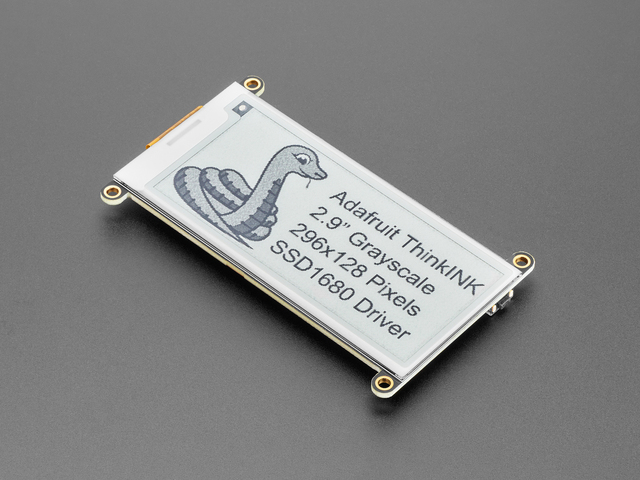
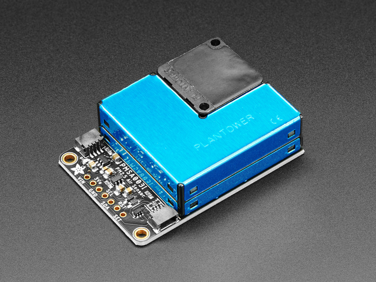
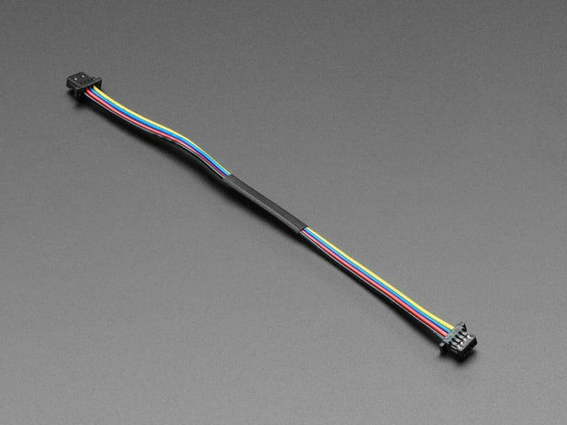
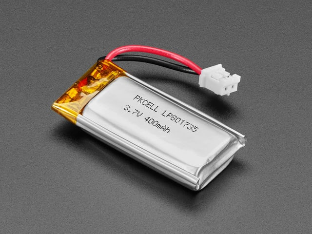

# Air quality monitor

A local, battery-powered PM2.5 monitor for fire season in the Boise / Meridian, Idaho area. It sits on a shelf or windowsill, reads wildfire smoke from a Plantower laser sensor, and shows **US EPA AQI** on a sunlight-readable e-ink screen. There is no phone app and no cloud — the display is the product.

Summer haze here is usually fine particles from regional fires, not ozone or traffic. The number that matters is **PM2.5**. This build tracks that, plus PM1.0 / PM10 and particle counts, then sleeps so a small LiPo lasts days instead of hours.

**Approximate parts cost: ~$100** (Adafruit list prices, August 2026).

| [Hardware](#hardware) | [How it works](#how-it-works) | [Firmware](#firmware) |
| --- | --- | --- |

## Why this stack

- **Local.** Works during a power-adjacent smoke week without Wi‑Fi, Adafruit IO, or a phone.
- **Readable outdoors.** E-ink stays up with the power off and is usable in daylight, unlike a tiny OLED.
- **Low power.** The sensor’s fan draws ~180 mA from the battery while running. The firmware warms it up, takes a median of three samples, then cuts power and deep-sleeps.
- **Mostly plug-and-play.** Feather + FeatherWing stack, STEMMA QT for the sensor, LiPo that tucks under the headers.

Indoor / porch is the v1 goal. A sealed outdoor box would starve the laser sensor of air.

## Hardware

All parts are sold by Adafruit. The STEMMA cable is the **100 mm** length — long enough to exit the Feather / wing sandwich and leave the sensor sitting beside the stack with its vents open.

| Qty | Part | Adafruit | Price |
| ---: | --- | ---: | ---: |
| 1 | [FeatherS3\[D\] ESP32-S3](https://www.adafruit.com/product/6399) (Unexpected Maker) | 6399 | $24.95 |
| 1 | [2.9" grayscale eInk FeatherWing](https://www.adafruit.com/product/4777) (SSD1680) | 4777 | $22.50 |
| 1 | [PMSA003I air quality breakout](https://www.adafruit.com/product/4632) | 4632 | $44.95 |
| 1 | [STEMMA QT / Qwiic cable, 100 mm](https://www.adafruit.com/product/4210) | 4210 | $0.95 |
| 1 | [400 mAh LiPo, Feather-sized](https://www.adafruit.com/product/3898) | 3898 | $6.95 |
|  | **Total** |  | **$100.30** |

Prices are Adafruit’s single-unit list. Shipping, tax, and a USB-C data cable are extra.

### FeatherS3[D] — brains and power

[![FeatherS3[D] ESP32-S3](docs/images/6399-feathers3d.jpg)](https://www.adafruit.com/product/6399)

[Adafruit #6399](https://www.adafruit.com/product/6399) · [docs](docs/6399-feathers3d/)

Unexpected Maker’s ESP32-S3 Feather. Dual 240 MHz cores, 16 MB flash, 8 MB PSRAM, USB-C, LiPo charging, and a MAX17048 fuel gauge. Two STEMMA QT ports: **I2C1** stays up in deep sleep (fuel gauge), **I2C2** is on LDO2 so the air sensor can be powered down. The 400 mAh cell sits in the header well under the wing.

### 2.9" grayscale eInk FeatherWing — the screen

[](https://www.adafruit.com/product/4777)

[Adafruit #4777](https://www.adafruit.com/product/4777) · [docs](docs/4777-eink-featherwing/)

296×128, four gray levels, SSD1680 (not the old IL0373). Image stays with the power off. On USB the firmware samples every 30 seconds and only refreshes the panel when the numbers change. Three buttons on the **back** of the wing (left to right from the back):

- **A** — force a sample now
- **B** — flip between the AQI card and particle-count bins immediately (press B again to go back)
- **C** — unused
- **Reset** — reboots the Feather

### PMSA003I — the smoke sensor

[](https://www.adafruit.com/product/4632)

[Adafruit #4632](https://www.adafruit.com/product/4632) · [docs](docs/4632-pmsa003i/)

Plantower laser scatter module on a STEMMA QT breakout (I2C `0x12`). Reports PM1.0 / PM2.5 / PM10 and counts from 0.3–10 µm. The breakout boosts 3.3 V up to the 5 V the fan and laser need. This is a hobby sensor, not an FEM — treat it as a trend next to AirNow / PurpleAir, not a regulatory number.

### STEMMA QT cable, 100 mm

[](https://www.adafruit.com/product/4210)

[Adafruit #4210](https://www.adafruit.com/product/4210) · [docs](docs/4210-stemma-qt-100mm/)

4-pin JST-SH, both ends the same. Plug it into **I2C2 (near USB) before stacking the wing** — that jack is not on the long header. 100 mm is long enough to route out the battery gap and park the sensor beside the stack.

### 400 mAh LiPo

[](https://www.adafruit.com/product/3898)

[Adafruit #3898](https://www.adafruit.com/product/3898) · [docs](docs/3898-lipo-400mah/)

3.7 V, Feather-sized, 25 mm JST-PH. Charges from the Feather’s USB-C. A full cell is about **4.2 V**. With USB and no pack, the charger node floats ~4.0–4.3 V and SOC can read over 100% — the firmware shows `USB no batt` instead.

You do **not** need to leave USB + battery plugged in for the gauge to work. Powering down and unplugging the cell when idle is the right thing. Next boot, the MAX17048 estimates % from open-circuit voltage (quick-start). That is plenty for this display. A full charge/discharge “learn” cycle only tightens it; it is optional and not worth leaving the project on the charger unused.

At 15-minute samples the pack should last on the order of 3–5 days. Charge only via the Feather, and don’t puncture or bend it.

## How it works

Every sample the Feather enables **LDO2** (the 3.3 V rail on STEMMA I2C2), waits ~15 s for the PMSA003I fan, reads three frames, and keeps the median. If the sample interval is under 60 s (USB default 30 s), LDO2 stays on so you are not paying warmup every time. At 5 minutes or the 15-minute battery interval, LDO2 drops between reads and the sensor is fully off. PM2.5 (environmental) is converted with the **2024 US EPA AQI breakpoints** — same scale AirNow and Idaho DEQ use — as an instantaneous value, not 24-hour NowCast.

To sleep the sensor on USB too, set `USB_SAMPLE_INTERVAL_S = 300` in `settings.toml` (5 minutes).

The 2.9" card shows a large AQI number and category, a 4-gray bar, then PM1.0 / PM2.5 / PM10 in µg/m³ plus battery and USB status.

| Power | Sample interval | What it does |
| --- | --- | --- |
| USB-C | 60 seconds | Stays awake; LDO2 off between samples |
| Battery | 60 seconds, 5 s warmup | Sleeps between samples (`SLEEP_MODE`); ~8–13% sensor duty |
| Cell ≤ 3.2 V | Halt | LOW BATT card, **deep** sleep until USB (or 1 h recheck) |

Wi-Fi and Bluetooth are forced off at boot (`boot.py`) and again before sleep. Nothing in this firmware connects.

`SLEEP_MODE` in `settings.toml`:

- `"deep"` (default) — lowest current; `code.py` restarts each wake
- `"light"` — CPU paused, RAM kept, faster wake, more sleep current (tens of mA vs µA)
- `"no"` — CPU stays awake; LDO2/sensor on only for each sample (stays on if the interval is under 30 s)
- `"full"` — CPU and PMSA003I/LDO2 stay on

Each sample appends one row to `CIRCUITPY/data/voltN.csv` (voltage, %, USB, PM1/2.5/10, particle bins). A new number is used on each power-up / USB reload; older files are kept. Copy `data/` off the drive into this repo’s `data/` folder. Set `VOLTAGE_LOG = 0` to disable.

CircuitPython cannot write CIRCUITPY while the Mac has it mounted as a normal disk. `boot.py` remounts the drive **MCU-writable** (Finder shows it read-only — you can still copy logs off). **Hold A at reset** when you need to copy firmware onto the board.

## Docs in this repo

- [docs/project.md](docs/project.md) — original BOM notes
- [docs/build-plan.md](docs/build-plan.md) — pin map, power budget, firmware phases
- [hardware/assembly.md](hardware/assembly.md) — how to stack the boards
- [hardware/enclosure/](hardware/enclosure/) — 3D-printed case (STLs + generator)
- [docs/](docs/) — datasheets and Adafruit learn guides

## Firmware

CircuitPython on the FeatherS3[D]. Source is in [`firmware/`](firmware/).

### Libraries

With the board mounted as `CIRCUITPY`:

```bash
pip install circup
circup install adafruit_pm25 adafruit_epd adafruit_max1704x adafruit_register neopixel
```

Copy `firmware/font5x8.bin` to the root of `CIRCUITPY`. The e-ink text routines need it.

### Install

1. Assemble the stack ([hardware/assembly.md](hardware/assembly.md)).
2. Copy `firmware/bringup.py` to `CIRCUITPY/code.py` and confirm I2C addresses in the serial console (`0x36` on I2C1, `0x12` on I2C2).
3. Copy the rest of `firmware/` onto `CIRCUITPY` (`code.py`, the `.py` modules, `settings.toml`, `font5x8.bin`).
4. The board resets and draws the AQI card.

### Tests (no hardware)

```bash
python3 -m unittest tests.test_aqi
```
