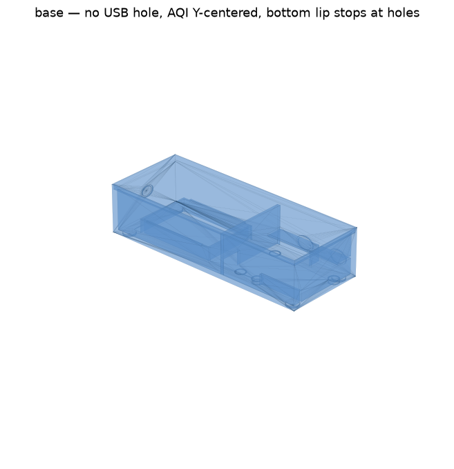
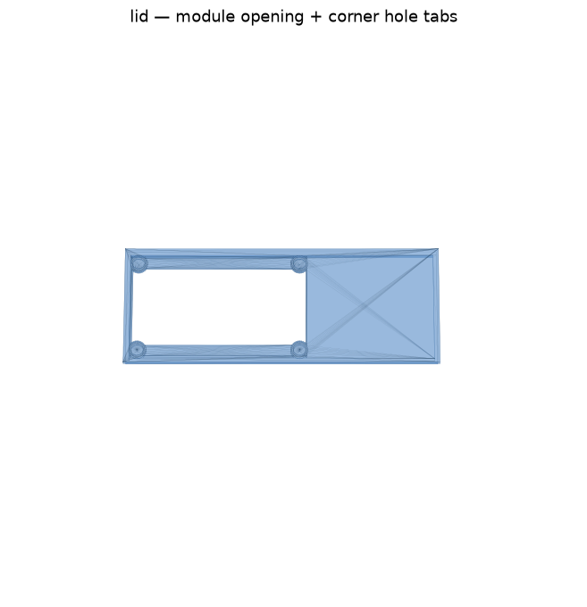

# 3D-printed enclosure (rev 2)

Two-piece FDM case. Display faces up. RP-SMA antenna bulkhead on the **left**. PMSA003I on the **floor** to the right, 2" axis away from the display. I/O channels stay at the **top** of the display. **No USB hole** — the Feather’s USB-C faces the AQI bay; plug in with the lid off.





Outside is about **145 × 56 × 45 mm**.

```
  TOP (+Y)     intake ○ | ○ exhaust     (divider 7/8" from the far end)
               ─────────┴─────────
  LEFT (-X)    [RP-SMA]  [ 2.9" eInk ]  [ PMSA003I, Y-centered on display ]
  BOTTOM (-Y)  closed; AQI lip stops short of the two bottom holes (STEMMA)
  UNDER STACK            [ battery cage, 1/2" ]
```

| File | What |
| --- | --- |
| [aq_enclosure_base.stl](aq_enclosure_base.stl) | Battery cage, SMA pad, floor-mount AQI, intake/exhaust divider, 9/16" channel lips |
| [aq_enclosure_lid.stl](aq_enclosure_lid.stl) | Opening is the 79 × 36.7 mm e-ink module; corner tabs hold the four holes |
| [generate.py](generate.py) | Parametric generator |

## What changed vs rev 1

- Stack is **1"** (Feather + eInk). Battery is **not** in the sandwich. USB-C faces the AQI bay; use it with the lid off.
- Battery lives in a **low-lipped cage** under the stack: pack is **2.00" × 1-5/16" × 3/8"**, cage interior **52.8 × 35.3 × 12.7 mm** (about 2 mm of rattle room, 1/2" height).
- **Lid mounts the display.** Opening is the **e-ink module** (79.0 × 36.7 mm), not just the glass. The four M2.5 holes sit inside that rectangle on the long axis, so the lid keeps **corner tabs** to screw through. Same four pads work two ways:
  - **Inside** the lid → module in the opening, buttons hidden
  - **Outside** the lid → wing sits in the outer pocket, buttons reachable
- **RP-SMA** (uFL pigtail, threaded barrel) on the left end. Printed **solid** with a raised ring; drill 6.5 mm after printing.
- **No printed through-holes.** Wing, sensor, SMA, and air ports are filled pads at wall thickness with a raised ring as a drill guide.
- Sensor sits **on the floor** of the right-hand bay, **centered top-to-bottom on the display**. The 2" axis points away from the display (header toward the partition, can at the far wall). Two corner holes sit on the **top** edge of the display; the third corner is on the **bottom** edge nearest the display. A short **freestanding lip** (battery-cage style) runs along the module’s bottom edge and stops before the two holes on that side so the STEMMA cable can reach the QT jack.
- A wall splits **intake** (toward the display, hole in the blue aluminum) from **exhaust** (fan, far end). The divider is on the top wall, **7/8" from the far end** (1-1/8" from the display side of the module). Each path ends at a raised ring — drill those after you confirm alignment. The module is **open on top**. A **9/16" lip** overlaps the can by about 3.5 mm and roofs the air channel out to the top wall.
- PMSA003I holes are **not** a 4-corner rectangle. Three sit in corners; one is on the output-side edge. The two header-end holes are open on the PCB (screw down from inside). The two under the can are marked with rings on the **outside of the floor** so you can drill from below and screw up.

## Display vs lid (Adafruit 4777 Eagle)

| | Size | Notes |
| --- | --- | --- |
| PCB | 79.38 × 46.99 mm (3.125" × 1.850") | FeatherWing outline |
| Mounting holes | 74.30 × 42.16 mm, M2.5, centered | Four corners |
| e-ink **module** (obstruction) | 79.0 × 36.7 mm | Almost full PCB length |
| Glass (active) | ~67.0 × 29 mm, shifted ~2.8 mm along the long axis | Inside the module |
| Hole vs module | **inside** the 79 mm length by ~2.2 mm; **outside** the 36.7 mm width by ~2.7 mm | Corner tabs |

The lid opening is the module. Corner tabs put the screw pads back so the holes are not cut away.

## Drill later

| Mark | Size | Where |
| --- | --- | --- |
| 4 rings on the lid | 2.5 mm | eInk FeatherWing corners |
| 2 rings on the sensor floor (inside) | 2.5 mm | PMSA003I header-end holes (open on the PCB; screw down from above) |
| 2 rings on the sensor floor (**outside**) | 2.5 mm | PMSA003I holes under the can (screw up from below) |
| 1 ring on the left wall | 6.5 mm | RP-SMA bulkhead |
| 2 rings on the top wall | ~8–10 mm | intake (left of the divider) and exhaust (right, fan) |

## Print

| Setting | Value |
| --- | --- |
| Material | PLA; PETG if it will sit in a hot car |
| Layer | 0.20 mm |
| Walls | 3 |
| Infill | 20% gyroid |
| Supports | **On for the base** — normal or tree, from the bed. They fill the intake/exhaust ducts and catch the 3.5 mm overhang onto the can. Pull them before the sensor goes in. Lid: none. |
| Base | floor down (feet on the bed) |
| Lid | **outer face / window on the bed** so the outside pocket is smooth |

Lid lip is 0.35 mm undersize (`FIT`). Sand if tight.

## Assembly

1. Drop the pack into the cage under the display bay, JST toward USB.
2. uFL pigtail on the Feather; RP-SMA barrel waits until you drill the left pad.
3. STEMMA into I2C2, cable through the partition notch, along the open stretch of the AQI bottom lip (before the two holes), into the QT jack on the bottom edge of the PMSA003I.
4. **Inside mount:** seat the wing in the inner lid pocket, glass in the window, screw after drilling. Buttons face the battery cage.
5. **Outside mount:** seat the wing in the outer lid pocket, glass facing out, buttons on the back of the wing in the open. Screw after drilling.
6. PMSA003I on the right-hand **floor**, header toward the display, can toward the far wall. Two corner holes on the top edge; third corner at the bottom nearest the display. Fan toward the **top-right** (far) port, blue intake hole toward the **top-left** (display-side) port. Screw the two header-end holes from inside; drill the two under-can holes from the outside and screw up. The small 9/16" lips should rest on the +Y edge of the can and cover the air channels; the rest of the module stays open. Snap the lid on.
7. Drill intake and exhaust only after a dry fit so the holes line up with the fan and the aluminum inlet. Do not let those two volumes mix.

## Regenerating

```bash
.venv/bin/python hardware/enclosure/generate.py
```

| Knob | Default | Meaning |
| --- | --- | --- |
| `BAT_L` / `BAT_W` | 52.8 / 35.3 | Cage inside, mm (2.00" × 1-5/16" pack + clearance) |
| `BAT_CAGE_H` | 12.7 | 1/2" |
| `STACK_H` | 25.4 | 1" electronics |
| `RIDGE_H` | 14.3 | 9/16" lip height above the floor |
| `CHANNEL_LIP` | 3.5 | how far that lip sits onto the can, mm |
| `DIV_FROM_FAR` | 22.2 | 7/8" — intake/exhaust divider from the far end |
| `SMA_Z` | cage + 10 | Height of the SMA pad |
| `FIT` | 0.35 | Lid looseness |
